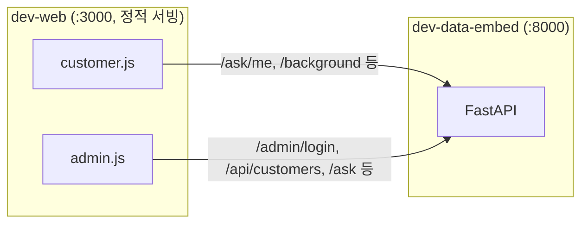
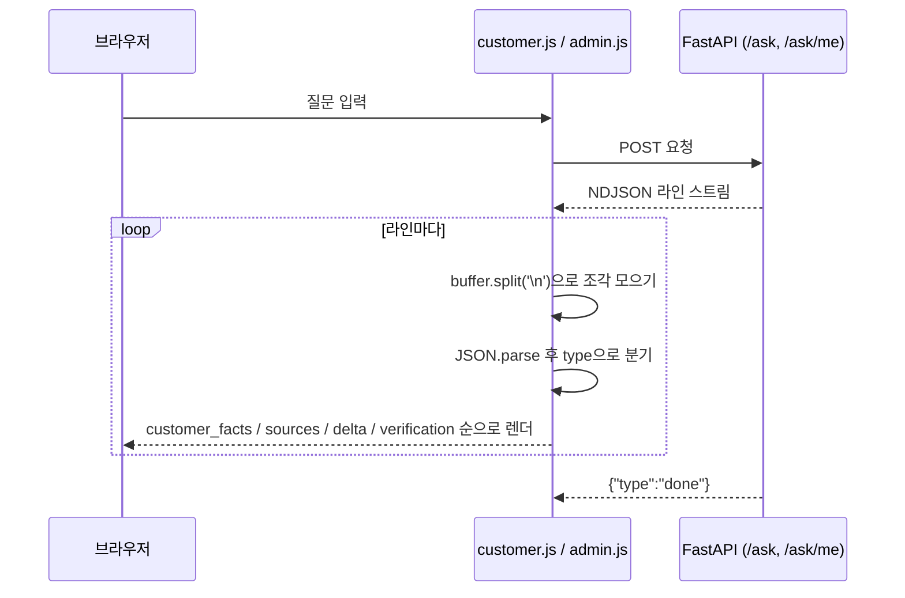

# dev-web

<br/>


<br/>

'오늘 뭐멍냥'의 **프론트엔드** — 관리자 대시보드 + 고객 페이지.
빌드 도구·프레임워크 없이 정적 HTML/CSS/Vanilla JS로만 구성되며, 데이터는 전부 sibling 저장소
[`dev-data-embed`](https://github.com/TodayWhatDish/dev-data-embed)의 FastAPI를 직접 호출해 받습니다.

## 화면 구성

| 화면 | 경로 | 기능 |
|---|---|---|
| 고객 페이지 | `frontend/public/customer/` | 로그인/회원가입, 펫·구매 이력 조회, AI 질문(스트리밍) |
| 관리자 대시보드 | `frontend/public/admin/` | 고객 검색·상세, 구매 이력 + 지출 그래프(Chart.js), 이력 기반 추천 · 판매 전략 · AI 질문 3탭 패널 |

## 아키텍처



이 저장소는 자체 백엔드가 없습니다 — API 계약(요청/응답 모양, 상태코드, 에러 메시지)의 기준은 항상 `dev-data-embed` 쪽입니다.

`/ask`, `/ask/me`는 NDJSON 스트리밍 응답이라, 두 스크립트 모두 아래와 같은 동일한 읽기 루프를 씁니다:



## 실행

```bash
# cwd: frontend/public
python3 -m http.server 3000
```

`dev-data-embed`의 FastAPI 서버가 `:8000`에 먼저 떠 있어야 합니다 — 모든 페이지가
`const API = "http://localhost:8000"`을 하드코딩해 교차 출처로 fetch합니다.
fetch가 조용히 실패하면 프론트를 의심하기 전에 백엔드부터 떠 있는지 확인하세요.

## 폴더 구조

```
frontend/
├── public/          # 실제 서빙되는 정적 페이지 (customer/, admin/)
├── entities/         ┐
├── features/         │  FSD 스캐폴드 — 아직 비어있음
├── shared/           │  (Next.js 마이그레이션 예정, docs/DESIGN.md 참고)
└── widgets/         ┘
```

## 라이선스

MIT — [`LICENSE`](LICENSE) 참고.
