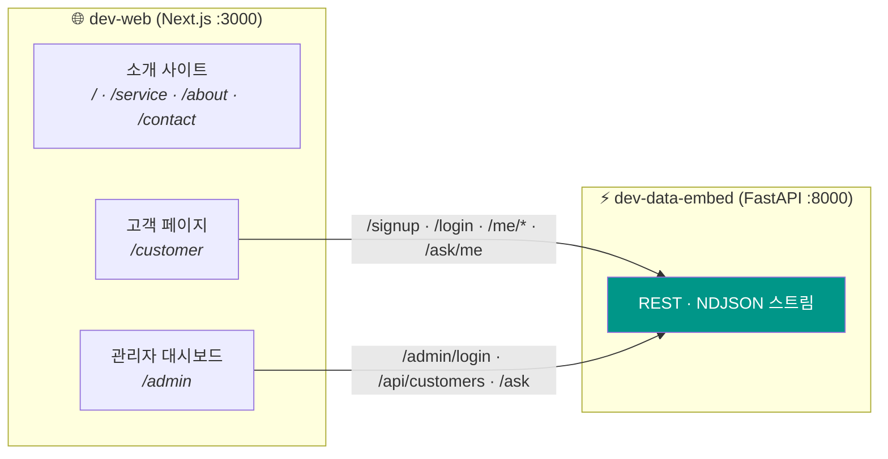
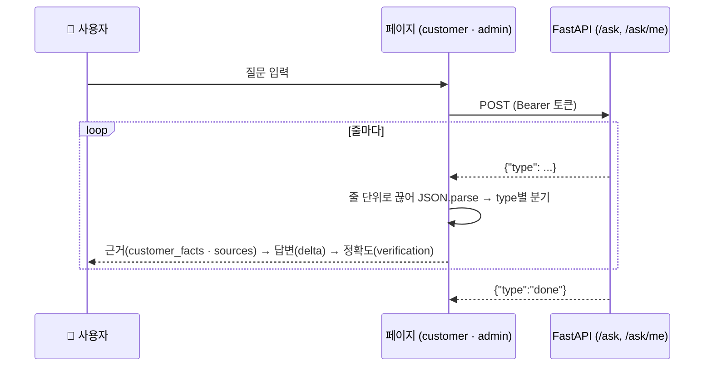

<div align="center">

# 🐶 오늘뭐멍냥 — Web 🐱

### 후기로 고르는 우리 아이 사료 · 간식

**서비스 소개 사이트 · 고객 페이지 · 관리자 대시보드를 담은 오늘뭐멍냥의 프론트엔드**

<br/>


<br/>


<br/>

[**소개**](#-소개) · [**화면 구성**](#-화면-구성) · [**동작 흐름**](#-동작-흐름) · [**기술 스택**](#-기술-스택) · [**실행**](#-로컬-실행) · [**배포**](#-배포) · [**구조**](#-프로젝트-구조)

</div>

---

## 📌 소개

오늘뭐멍냥은 반려동물의 알러지 · 체급 · 구매 이력을 근거로 AI가 사료와 간식을 추천하는 서비스입니다.
이 저장소는 그 **화면**을 담당하며, 데이터와 AI 기능은 전부 백엔드 저장소
[`dev-data-embed`](https://github.com/TodayWhatDish/dev-data-embed)의 FastAPI를 호출해서 받습니다.

| 누가 쓰나 | 어디서 | 무엇을 하나 |
|---|---|---|
| 🙋 처음 온 방문자 | 소개 사이트 `/` | 서비스가 무엇이고 어떻게 추천하는지 확인 |
| 🐾 반려인 (회원) | 고객 페이지 `/customer` | 가입 · 추천 받기 · AI 상담 · 구매와 리뷰 |
| 🧑‍💼 운영자 | 관리자 대시보드 `/admin` | 고객 분석 · 판매 전략 · 질문 기록 확인 |

---

## 🖥️ 화면 구성

<table>
<tr>
<td width="33%" valign="top">

### 🏠 소개 사이트
`/` · `/service` · `/about` · `/contact`

서비스 소개, 추천 방식 설명, 문의 폼(메일 앱으로 연결)을 담은 공개 페이지입니다.

</td>
<td width="33%" valign="top">

### 🐾 고객 페이지
`/customer`

회원가입(펫 · 알러지 · 식성 설문), 로그인 직후 **맞춤 추천**, 스트리밍 **AI 상담**, 구매 · 리뷰 작성.

</td>
<td width="33%" valign="top">

### 📊 관리자 대시보드
`/admin`

고객 검색 · 상세, **구매 금액 그래프**, 이력 기반 추천 · 판매 전략 · AI 질문 3탭 패널, 고객 질문 기록.

</td>
</tr>
</table>

---

## 🔄 동작 흐름

### 화면과 API



이 저장소에는 자체 백엔드가 없습니다. 요청 · 응답 모양, 상태코드, 에러 메시지의 기준은 항상 `dev-data-embed` 쪽입니다.

### AI 답변이 화면에 그려지기까지

`/ask`, `/ask/me`는 답변을 한 번에 주지 않고 **한 줄씩(NDJSON)** 흘려보냅니다. 두 페이지 모두 같은 읽기 루프를 씁니다.



---

## 🧰 기술 스택

| 영역 | 기술 |
|---|---|
| **Framework** | Next.js 16 (App Router) · React 19 · JavaScript |
| **Style** | 페이지별 CSS · Pretendard / Jua 웹폰트 |
| **Chart** | Chart.js (CDN, 관리자 구매 금액 그래프) |
| **API** | `dev-data-embed` FastAPI — JWT Bearer 인증 · NDJSON 스트리밍 |
| **Quality** | ESLint (`eslint-config-next`) |

---

## 💻 로컬 실행

**요구 사항:** Node.js 22+ · 백엔드 [`dev-data-embed`](https://github.com/TodayWhatDish/dev-data-embed)가 `:8000`에 떠 있을 것

```bash
cd web
npm install
npm run dev          # http://localhost:3000
```

| 환경변수 | 기본값 | 설명 |
|---|---|---|
| `NEXT_PUBLIC_API_URL` | `http://localhost:8000` | 백엔드 주소. 배포 때만 넣습니다 (`web/.env.local` 또는 배포 플랫폼 설정) |

> 화면이 비거나 요청이 조용히 실패하면 **백엔드가 떠 있는지**부터 확인하세요.
> 배포 도메인에서 부를 때는 백엔드의 `FRONTEND_ORIGINS`(CORS 허용 목록)에 그 도메인을 넣어야 합니다.

---

## 🚀 배포

| 대상 | 상태 |
|---|---|
| `web/` (Next.js) | 배포 방식 미정 — Vercel 또는 Docker ([`docs/REFACTOR.md`](./docs/REFACTOR.md) FE-28) |
| 백엔드 API | Railway (`dev-data-embed`) |

**⚠️ 알려진 보안 한계** — 로그인 토큰(JWT)을 브라우저 `localStorage`에 저장합니다. 페이지에 스크립트가 주입되면(XSS) 토큰을 읽어 갈 수 있습니다.
장기적으로는 같은 오리진 프록시(rewrites) + httpOnly 쿠키로 옮길 예정입니다 (FE-10).

---

## 📁 프로젝트 구조

```
dev-web/
├── web/                       # Next.js 앱 (현재 버전)
│   ├── src/app/
│   │   ├── (site)/              소개 사이트 — 홈 · 서비스 · 소개 · 문의
│   │   ├── customer/            고객 페이지
│   │   ├── admin/               관리자 대시보드
│   │   ├── layout.js            공통 레이아웃
│   │   └── globals.css          공통 스타일
│   └── public/                  이미지 · 폰트
│
├── frontend/                  # 구버전 정적 HTML/JS — web/으로 이전 완료, 삭제 예정 (FE-20)
└── docs/                      # 디자인 · 규칙 · 리팩터링 체크리스트
```

---

## 📚 더 보기

| 문서 | 내용 |
|---|---|
| [docs/DESIGN.md](./docs/DESIGN.md) | 화면 디자인 기준 |
| [docs/REFACTOR.md](./docs/REFACTOR.md) | 프론트엔드 리팩터링 체크리스트 |
| [dev-data-embed README](https://github.com/TodayWhatDish/dev-data-embed#readme) | 백엔드 · API · 데이터 파이프라인 |

## 📄 라이선스

MIT — [`LICENSE`](./LICENSE) 참고.
