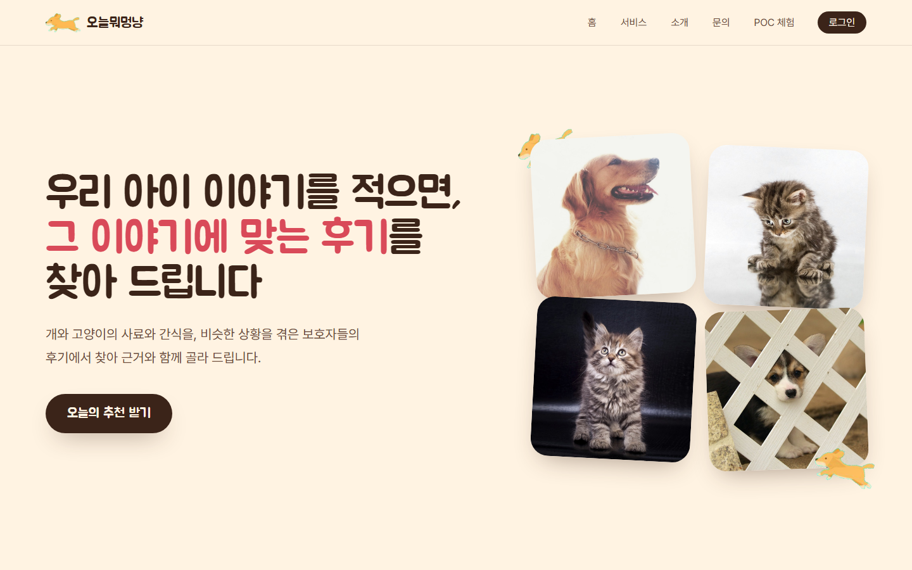
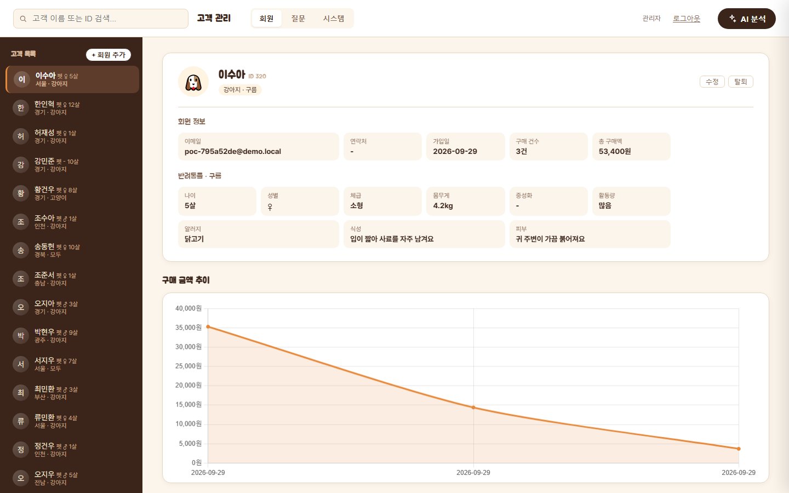
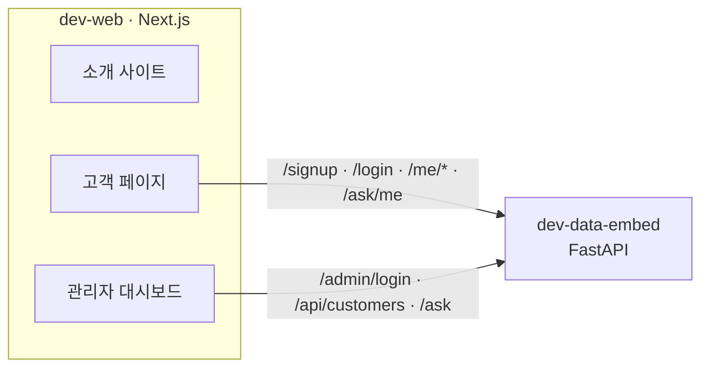

<div align="center">

# 오늘뭐멍냥 — Web

후기로 고르는 우리 아이 사료 · 간식<br/>
서비스 소개 사이트 · 고객 페이지 · 관리자 대시보드


**[서비스 바로가기 → twd-web.vercel.app](https://twd-web.vercel.app)**



</div>

<br/>

## 소개

오늘뭐멍냥은 반려동물의 알러지 · 체급 · 구매 이력을 근거로 AI가 사료와 간식을 추천하는 서비스입니다.
이 저장소는 **화면**을 담당하고, 데이터와 AI 기능은 백엔드 [dev-data-embed](https://github.com/TodayWhatDish/dev-data-embed)의 API를 호출해 받습니다.

## 화면 구성

| 화면 | 경로 | 설명 |
|---|---|---|
| **소개 사이트** | `/` `/service` `/about` `/contact` | 서비스 소개, 추천 방식 설명, 문의 폼 |
| **고객 페이지** | `/customer` | 회원가입(펫 · 알러지 · 식성 설문), 맞춤 추천, 스트리밍 AI 상담, 구매 · 리뷰 |
| **관리자 대시보드** | `/admin` | 고객 검색 · 상세, 구매 금액 그래프, 추천 · 판매 전략 · AI 질문 패널, 질문 기록 |

| 고객 페이지 — AI 상담 · 맞춤 추천 | 관리자 대시보드 — 고객 상세 |
|---|---|
|  |  |

## 아키텍처


```mermaid
flowchart LR
    subgraph WEB[dev-web · Next.js]
        SITE[소개 사이트]
        C[고객 페이지]
        A[관리자 대시보드]
    end

    C -->|/signup · /login · /me/* · /ask/me| API
    A -->|/admin/login · /api/customers · /ask| API
    API[dev-data-embed<br/>FastAPI]
```

- **자체 백엔드가 없습니다.** 요청 · 응답 모양, 상태코드, 에러 메시지의 기준은 항상 dev-data-embed입니다.
- **답변은 한 줄씩 그립니다.** `/ask` · `/ask/me`는 NDJSON 스트림이라, 줄 단위로 끊어 `type`별로 근거 → 답변 → 정확도 순으로 화면에 붙입니다.
- **인증은 JWT Bearer 토큰입니다.** 현재 `localStorage`에 저장합니다 — 한계는 [아래](#알려진-보안-한계) 참고.

## 기술 스택

| 영역 | 사용 기술 |
|---|---|
| Framework | Next.js 16 (App Router), React 19, JavaScript |
| Style | 페이지별 CSS, Pretendard · Jua 웹폰트 |
| Chart | Chart.js (관리자 구매 금액 그래프) |
| API | dev-data-embed FastAPI — JWT 인증, NDJSON Streaming |
| Deploy | Vercel |
| Quality | ESLint |

## 프로젝트 구조

```
src/app/
  (site)/               소개 사이트 — 홈 · 서비스 · 소개 · 문의
  customer/             고객 페이지
  admin/                관리자 대시보드
public/                 이미지 · 폰트
docs/                   디자인 기준 · 리팩터링 체크리스트 · README 스크린샷
```

## 로컬 실행

Node.js 22+와, `:8000`에서 실행 중인 [dev-data-embed](https://github.com/TodayWhatDish/dev-data-embed)가 필요합니다.

```bash
npm install
npm run dev            # http://localhost:3000
```

백엔드 주소는 `NEXT_PUBLIC_API_URL`(기본 `http://localhost:8000`)로 바꿉니다.
배포 도메인에서 부를 때는 백엔드 `FRONTEND_ORIGINS`(CORS)에 그 도메인을 추가해야 합니다.
Vercel 배포에서는 `NEXT_PUBLIC_API_URL`을 Vercel 환경 변수로 넣습니다.

## 더 보기

- [개발 규칙](./AGENTS.md)
- [디자인 기준](./docs/DESIGN.md)
- [리팩터링 체크리스트](./docs/REFACTOR.md)

## 알려진 보안 한계

- **JWT를 `localStorage`에 둔다** (`src/app/admin/page.js`의 `adminToken`,
  `src/app/customer/page.js`의 `userToken`). 페이지에 XSS가 하나라도 생기면 스크립트가 토큰을
  그대로 읽어 간다 — 관리자 토큰이면 전체 고객 정보가 노출된다.
- **XSS란** 후기 같은 사용자 입력에 HTML을 섞어, 화면에 그려질 때 그 안의 스크립트가 실행되게 하는 공격이다.
  예를 들어 후기에 ``가
  HTML로 그려지면 토큰이 외부로 나간다. React는 문자열을 기본으로 이스케이프하므로,
  외부 스크립트를 넣거나 `dangerouslySetInnerHTML`을 쓸 때 이 전제를 떠올릴 것.
- 장기 해결: Next.js rewrites로 API를 같은 origin에 두고 `httpOnly` 쿠키로 옮긴다 (별도 이슈).

## 라이선스

MIT — [`LICENSE`](LICENSE) 참고.
